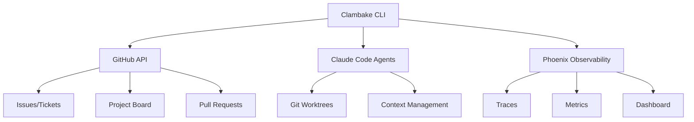

# Clambake: GitHub-Native Multi-Agent Orchestration

> **The industrial-strength CLI for orchestrating 8-12 concurrent AI coding agents**  
> Built on lessons from the event-api disaster. Zero work loss. Zero state corruption. Zero manual sync.

[](https://github.com/your-org/clambake/actions)
[](LICENSE)
[](https://www.rust-lang.org)

## What is Clambake?

Clambake orchestrates multiple Claude Code sub-agents working concurrently on your codebase, using GitHub as the single source of truth and Arize Phoenix for complete observability. No more coordination chaos, no more lost work, no more manual state management.

### The Problem We Solve

Traditional single-developer workflows break down when you have 8-12 AI agents working simultaneously:
- **Work gets lost** during agent cleanup
- **Branches conflict** without coordination  
- **State corrupts** across multiple systems
- **Integration fails** due to race conditions

### The Clambake Solution

```bash
# One command to orchestrate your entire agent workforce
clambake route --agents 8 --priority high
clambake status  # Real-time coordination view
clambake land    # Safely integrate all completed work
```

## Quick Start

```bash
# Install Clambake
cargo install clambake

# Initialize your project for multi-agent development
cd your-project
clambake init --agents 8

# Route work to agents
clambake route

# Monitor progress with Phoenix observability
clambake dashboard
```

## Core Principles

1. **GitHub is Truth**: No local state files, no manual sync, no dual authorities
2. **Atomic Operations**: All state changes succeed together or fail together
3. **Work Preservation**: Completed work is never lost, even during failures
4. **Observable by Design**: Every coordination decision traced in Phoenix
5. **Safety First**: Compile-time guarantees prevent coordination disasters

## Documentation Structure

- [`src/`](src/README.md) - Core application code and architecture
- [`tests/`](tests/README.md) - Comprehensive test suite with chaos engineering
- [`specs/`](specs/README.md) - Living specifications and domain requirements
- [`docs/`](docs/README.md) - User guides and API documentation
- [`scripts/`](scripts/README.md) - Automation and setup tools
- [`templates/`](templates/README.md) - Project starter templates

## Key Features

### 🤖 Multi-Agent Orchestration
- Route tickets to 8-12 concurrent Claude Code agents
- Isolated git worktrees prevent conflicts
- Intelligent dependency resolution
- Automatic context management

### 🔄 GitHub-Native Integration
- Issues become tickets
- Project boards track agent state
- PRs integrate completed work
- No custom state files needed

### 📊 Day-One Observability
- Arize Phoenix tracing built-in
- Real-time coordination metrics
- Agent performance analytics
- Decision tree visualization

### 🛡️ Enterprise-Grade Safety
- Atomic state transitions
- Automatic work preservation
- Chaos-resistant operations
- Zero manual synchronization

## Architecture



## Commands Overview

| Command | Purpose |
|---------|---------|
| `clambake init` | Initialize multi-agent development environment |
| `clambake route` | Assign tickets to available agents |
| `clambake land` | Integrate completed work to main branch |
| `clambake status` | Show system and agent status |
| `clambake recover` | Recover orphaned work |
| `clambake dashboard` | Launch Phoenix observability dashboard |

## Requirements

- Rust 1.75+
- Git 2.30+
- GitHub repository with Issues and Projects enabled
- Docker (for Phoenix observability stack)

## Contributing

See [CONTRIBUTING.md](CONTRIBUTING.md) for development setup and guidelines.

## License

MIT - See [LICENSE](LICENSE) for details.

## Learn More

- [Architecture Decision Records](docs/architecture/)
- [Integration Guides](docs/user-guide/)
- [API Documentation](https://docs.rs/clambake)

---

**Built on the ashes of event-api. Designed to never repeat those mistakes.**