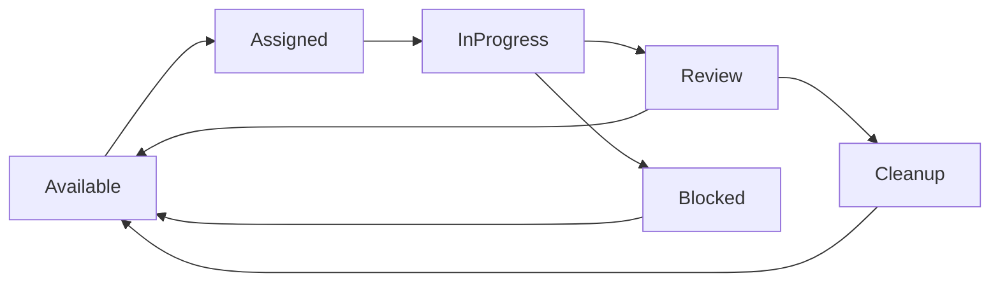

# My Little Soda: GitHub-Native Autonomous Agent CLI

## Overview

A high-performance Rust CLI tool that enables a single autonomous coding agent to work continuously on your GitHub Issues while you focus elsewhere. My Little Soda provides unattended operation and multiplicative productivity through the one-agent-per-repo architecture. It routes issues, manages autonomous agent work, and ensures completed code lands on main through proper GitHub workflows - enabling true multiplicative productivity where 8 hours human work + 3 autonomous agents across different repositories = 32 repo-hours of progress.

## Core Problem Statement

**The Autonomous Agent Reality**: Autonomous coding agents can work continuously on GitHub Issues, but traditional coordination systems fail when scaling across multiple repositories. The key insight is that productivity multiplies horizontally across repositories, not vertically within a single repository.

**Current Failures at Scale**:
- **Work Loss**: Agent cleanup destroys completed work before integration
- **Workflow Fragmentation**: Feature branches never merge to main  
- **State Corruption**: Dual coordination systems create synchronization failures
- **Assignment Drift**: Agents become disconnected from their actual work
- **Coordination Complexity**: Multi-agent coordination within single repository creates exponential complexity
- **Productivity Bottlenecks**: Manual agent management becomes developer bottleneck

**My Little Soda Solution**: GitHub-native orchestration + single autonomous agent per repository + horizontal scaling across repositories = Multiplicative productivity through unattended operation while maintaining simplicity.

## Architecture Philosophy

### 🏗️ CRITICAL ARCHITECTURAL CONSTRAINT

**ONE AGENT PER REPOSITORY - NEVER CONCURRENT AGENTS IN SAME REPO**

My Little Soda follows a strict **ONE AGENT PER REPOSITORY** architecture:

✅ **Correct Architecture:**
- Single autonomous agent processes issues sequentially within one repository
- Scale productivity by running multiple My Little Soda instances across different repositories
- Agent operates unattended while human focuses on other work
- Multiplicative productivity: 8 hours human + 3 autonomous agents = 32 repo-hours

❌ **Never Implement:**
- Multiple concurrent agents in the same repository
- Agent-to-agent coordination or communication
- Resource sharing between agents in the same repo
- Complex multi-agent merge conflict resolution

**Why This Architecture?**

**Productivity Focus:** The goal is multiplicative productivity through horizontal scaling across repositories, not complex coordination within a single repository.

**Simplicity:** Single-agent operation eliminates:
- Merge conflicts between agents
- Complex coordination logic
- Resource contention issues
- Agent-to-agent communication overhead

**Autonomous Operation:** Enables true unattended operation where the agent works continuously while the human developer focuses elsewhere.

### GitHub-Native Everything
- **GitHub Issues** = Authoritative ticket system
- **GitHub Projects V2** = Sprint planning & backlog management
- **GitHub PRs** = Code review & integration pipeline
- **GitHub Actions** = CI/CD automation triggers
- **GitHub API** = Single source of truth for all coordination

### Agent Safety First
- **Work Preservation**: Never destroy work before it's safely integrated
- **Atomic Operations**: All state changes must be reversible and consistent
- **Conflict Prevention**: Proactive coordination prevents rather than resolves conflicts
- **Recovery Mechanisms**: Automatic detection and repair of coordination failures

### Test-Driven Development (TDD)
- **Test-First Architecture**: All components are designed with testability as primary concern
- **Behavior-Driven Specifications**: Every feature has comprehensive test coverage before implementation
- **Continuous Validation**: Agent orchestration workflows are continuously tested against real GitHub API
- **Regression Prevention**: Test suite prevents coordination failures from reoccurring
- **Agent Workflow Testing**: End-to-end tests simulate complete agent lifecycles

### DRY/SOLID Principles
- **Single Responsibility**: Each module handles exactly one aspect of orchestration
- **Open/Closed**: Extensible for new agent types without modifying core coordination logic
- **Liskov Substitution**: Agent implementations are fully interchangeable
- **Interface Segregation**: Clean API boundaries between GitHub integration, state management, and coordination
- **Dependency Inversion**: Core orchestration logic depends on abstractions, not GitHub API specifics
- **Don't Repeat Yourself**: Common patterns (state transitions, error handling, recovery) are abstracted into reusable components

### Autonomous Agent Integration Philosophy
- **Single Agent Operation**: One autonomous agent processes issues sequentially within repository
- **Unattended Operation**: Agent works continuously while human focuses on other repositories or tasks
- **Sequential Processing**: Issues are processed one at a time to eliminate coordination complexity
- **Context Management**: Intelligent context window management for single agent sessions
- **Test-Driven Development**: TDD workflows optimized for autonomous single-agent operation

### Arize Phoenix Observability Philosophy  
- **Day-One Observability**: Phoenix tracing integrated from first agent deployment, not as afterthought
- **OpenTelemetry Native**: OTLP-based instrumentation for vendor-agnostic, future-proof observability
- **Agent Decision Tracing**: Complete visibility into multi-agent coordination decisions and execution paths
- **Performance-Driven Optimization**: Data-driven agent assignment and workflow optimization
- **Development-Production Continuity**: Same observability stack from local development through production deployment

## Command Structure

```bash
# Project initialization - One-stop setup
clambake init                      # Initialize complete multi-agent development environment
clambake setup-claude              # Configure Claude Code sub-agent integration
clambake setup-phoenix             # Deploy Arize Phoenix observability stack

# Agent orchestration commands
clambake route [OPTIONS]           # Route tickets to available Claude Code sub-agents
clambake agents                    # Manage 8-12 concurrent agent lifecycle
clambake sync                      # Synchronize agent status with GitHub + Claude Code
clambake land                      # Land completed work to main via PRs

# Observability and monitoring
clambake status                    # Show system, agent, and Phoenix observability status
clambake traces                    # Query and analyze agent execution traces
clambake metrics                   # Display agent performance and coordination metrics
clambake debug [AGENT_ID]          # Debug specific agent execution path

# Workflow management
clambake cleanup                   # Clean up completed workflows safely
clambake recover [BRANCH]          # Recover orphaned work from branches
clambake sprint [start|end]        # Manage sprint boundaries with agent coordination

# Developer experience
clambake dashboard                 # Launch unified monitoring dashboard
clambake logs [AGENT_ID]           # Stream agent execution logs
clambake context [AGENT_ID]        # Manage Claude Code agent context windows
```

## Core Workflows

### 1. Ticket Routing (`clambake route`)

**Input**: Available GitHub Issues with proper labels
**Output**: Assigned issues with Claude Code sub-agents deployed to git worktrees

```bash
# Route next available tickets to idle Claude Code sub-agents
clambake route --agents 8 --priority high --think-level hard

# Route specific ticket types with observability
clambake route --labels "bug,critical" --agents 3 --trace-level detailed

# Route with dependency checking and concurrent limits
clambake route --check-dependencies --max-concurrent 12 --load-balance
```

**Claude Code Sub-Agent Integration**:
- Spawns Claude Code sub-agents with specialized system prompts per ticket type
- Creates isolated git worktrees for each agent (enables shared local development setup)
- Configures agent context windows based on codebase size and ticket complexity
- Implements automatic `/clear` context management between tickets
- Triggers "think harder" mode for complex coordination decisions

**GitHub + Phoenix Integration**:
- Queries GitHub Issues with `status:open` and routing labels
- Checks agent availability via GitHub Project board status
- Creates feature branches with naming convention: `agent-{id}/{issue-number}-{slug}`
- Assigns GitHub Issue to agent user account
- Updates GitHub Project board with "In Progress" status
- **Phoenix Tracing**: Captures routing decision tree and agent assignment rationale
- **OTLP Instrumentation**: Records routing latency, conflict detection, and load balancing metrics

**Safety Mechanisms**:
- Validates no conflicting work assignments across 8-12 concurrent agents
- Checks for dependency requirements in issue links
- Ensures agent capacity limits (max concurrent per agent type)
- Creates atomic GitHub API transaction for assignment
- **Phoenix Monitoring**: Alerts when routing conflicts or capacity violations occur

### 2. Work Integration (`clambake land`)

**Purpose**: Safely integrate completed Claude Code sub-agent work to main branch with full observability

```bash
# Land all ready work with Phoenix tracing
clambake land --auto-merge --trace-integration

# Land specific agent's work with performance analysis
clambake land --agent claude-agent-001 --require-review --analyze-performance

# Land with custom merge strategy and conflict prediction
clambake land --strategy squash --delete-branch --predict-conflicts
```

**Claude Code Integration Flow**:
1. **Agent Work Detection**: Scan Claude Code agent worktrees for completion signals
2. **Context Validation**: Verify agent completed work properly (no hanging context)
3. **Test Execution**: Run agent-generated tests to validate implementation
4. **Code Quality Gates**: Apply static analysis and formatting checks
5. **Worktree Cleanup**: Safely clean Claude Code agent workspace after PR creation

**GitHub + Phoenix Integration Flow**:
1. **Discovery**: Scan for agent branches with completed work indicators
2. **Phoenix Pre-Integration Tracing**: Record integration attempt with agent performance metrics
3. **PR Creation**: Create GitHub PR from agent branch to main with Phoenix trace links
4. **CI Validation**: Wait for GitHub Actions to pass with Phoenix performance monitoring
5. **Review Request**: Add reviewers based on project configuration and agent complexity analysis
6. **Auto-merge**: Merge when CI passes and reviews approve
7. **Phoenix Post-Integration Metrics**: Record successful integration metrics and agent productivity data
8. **Cleanup**: Delete feature branch and update issue status
9. **Notification**: Comment on issue with merge confirmation and Phoenix dashboard links

**Enterprise Work Preservation**:
- Never deletes branches until PR is successfully merged
- Creates backup refs before any destructive operations  
- Maintains audit trail of all integration attempts with Phoenix trace correlation
- Rollback capability if merge conflicts occur with automatic agent re-assignment
- **Phoenix Integration Monitoring**: Tracks integration success rates, time-to-merge, and agent productivity metrics

### 3. Agent Coordination (`clambake sync`)

**Purpose**: Maintain consistent state between local agent workspaces and GitHub

```bash
# Full synchronization
clambake sync --all

# Sync specific agents
clambate sync --agents agent-001,agent-002

# Sync with conflict resolution
clambake sync --resolve-conflicts --strategy github-wins
```

**Synchronization Process**:
1. **GitHub State Query**: Fetch current issue assignments and PR status
2. **Local State Discovery**: Scan agent workspaces for active work
3. **Conflict Detection**: Identify state mismatches
4. **Resolution**: Apply configured conflict resolution strategy
5. **Update**: Synchronize both local and GitHub state
6. **Validation**: Verify synchronization success

### 4. Recovery Operations (`clambake recover`)

**Purpose**: Salvage work from orphaned branches and failed coordination

```bash
# Recover all orphaned branches
clambake recover --scan-all --dry-run

# Recover specific branch
clambake recover feature/agent-001/123-implement-auth

# Bulk recovery with pattern matching
clambake recover --pattern "agent-*" --create-prs
```

**Recovery Process**:
1. **Branch Analysis**: Analyze branch for meaningful commits
2. **Work Assessment**: Determine if branch contains completed features
3. **PR Creation**: Create recovery PR with detailed context
4. **Issue Linking**: Link PR to original issue if discoverable
5. **Review Assignment**: Assign for human review due to recovery context

## Agent Lifecycle Management

### Agent States (GitHub Project Board Columns)
- **Available**: Ready for new ticket assignment
- **Assigned**: Has ticket but hasn't started work
- **In Progress**: Actively working on assigned ticket  
- **Review**: Work complete, PR created, awaiting review
- **Blocked**: Cannot proceed, requires human intervention
- **Cleanup**: Agent completed, workspace being cleaned

### State Transitions



**State Management**:
- GitHub Project board is authoritative source for agent state
- GitHub Issue assignee tracks which agent owns which ticket
- GitHub PR status indicates work completion and review state
- Local workspace directories mirror GitHub state

### Agent Assignment Algorithm

```rust
// Pseudocode for intelligent ticket routing
fn route_tickets() -> Result<Vec<Assignment>> {
    let available_agents = github.get_available_agents()?;
    let pending_tickets = github.get_open_issues_with_routing_labels()?;
    
    for ticket in pending_tickets.priority_sorted() {
        let best_agent = find_optimal_agent(
            &available_agents,
            &ticket,
            &dependency_graph,
            &agent_workload
        )?;
        
        assign_ticket_to_agent(ticket, best_agent)?;
    }
}

fn find_optimal_agent(agents: &[Agent], ticket: &Issue, deps: &Graph, workload: &Map) -> Agent {
    // Factors:
    // 1. Agent availability
    // 2. Dependency conflicts with current assignments
    // 3. Workload balancing
    // 4. Agent skill matching (if configured)
    // 5. Geographic/timezone considerations
}
```

## Core Integrations: The Multi-Agent Development Stack

### One-Stop Project Initialization (`clambake init`)

**Complete Environment Setup**:
```bash
# Initialize fresh repository for multi-agent development
clambake init --project-type webapp --agents 8 --observability full

# Setup for existing repository  
clambake init --existing-repo --upgrade-to-multi-agent --agents 12
```

**What `clambake init` Creates**:
1. **GitHub Repository Configuration**:
   - GitHub Issues with multi-agent routing labels
   - GitHub Projects V2 board with agent coordination columns
   - Branch protection rules optimized for agent workflows
   - GitHub Actions workflows for CI/CD with Phoenix integration

2. **Claude Code Sub-Agent Infrastructure**:
   - Git worktree structure for 8-12 concurrent agents
   - Agent-specific system prompt templates
   - Context management configuration
   - Test-driven development workflow templates

3. **Arize Phoenix Observability Stack**:
   - Phoenix server deployment (Docker Compose)
   - OpenTelemetry instrumentation setup
   - Agent performance dashboards
   - Integration with local development environment

4. **Project Structure**:
   ```
   your-project/
   ├── .clambake/
   │   ├── config.toml              # Clambake configuration
   │   ├── agents/                  # Agent configurations
   │   ├── phoenix/                 # Phoenix observability setup
   │   └── templates/               # Code generation templates
   ├── .github/
   │   ├── workflows/
   │   │   ├── agent-ci.yml         # Agent-optimized CI/CD
   │   │   └── phoenix-deploy.yml   # Phoenix deployment
   │   └── ISSUE_TEMPLATE/
   │       └── agent-routing.yml    # Agent-ready issue templates
   ├── worktrees/                   # Git worktree isolation for agents
   │   ├── agent-001/
   │   ├── agent-002/
   │   └── ...
   ├── docker-compose.phoenix.yml   # Phoenix observability stack
   └── README.md                    # Multi-agent development guide
   ```

### Claude Code Integration Layer

**Sub-Agent Management**:
```rust
pub struct ClaudeCodeIntegration {
    agent_pool: Vec<ClaudeAgent>,
    worktree_manager: GitWorktreeManager,
    context_coordinator: ContextCoordinator,
    thinking_orchestrator: ThinkingOrchestrator,
}

impl ClaudeCodeIntegration {
    // Spawn specialized sub-agents based on ticket requirements
    pub async fn spawn_agent(&self, ticket: &GitHubIssue) -> Result<ClaudeAgent> {
        let agent_type = self.classify_ticket_complexity(ticket)?;
        let worktree = self.worktree_manager.create_isolated_workspace(ticket)?;
        let system_prompt = self.generate_specialized_prompt(ticket, agent_type)?;
        
        ClaudeAgent::new()
            .with_worktree(worktree)
            .with_system_prompt(system_prompt)
            .with_thinking_level(self.determine_thinking_level(ticket))
            .with_context_management(ContextStrategy::AutoClear)
            .spawn()
            .await
    }
    
    // Coordinate multiple agents working on related tickets
    pub async fn coordinate_agents(&self, agents: Vec<ClaudeAgent>) -> Result<CoordinationPlan> {
        // Prevent agents from conflicting on shared files
        // Implement dependency ordering for related tickets
        // Manage context window coordination
    }
}
```

**Thinking Level Integration**:
- **"think"**: Standard ticket complexity, basic coordination decisions
- **"think hard"**: Complex tickets with dependencies, integration requirements  
- **"think harder"**: Multi-agent coordination, conflict resolution, architectural decisions
- **"ultrathink"**: System-wide changes, complex refactoring, agent orchestration optimization

**Git Worktree Coordination**:
```bash
# Clambake automatically manages worktrees for agent isolation
worktrees/
├── agent-001/              # Feature: user authentication
├── agent-002/              # Feature: payment processing  
├── agent-003/              # Bug: performance optimization
└── shared/                 # Shared resources, documentation
```

### Arize Phoenix Observability Integration

**Day-One Observability Setup**:
```rust
pub struct PhoenixIntegration {
    tracer: OpenTelemetryTracer,
    evaluator: AgentEvaluator,
    metrics_collector: MetricsCollector,
    dashboard_manager: DashboardManager,
}

impl PhoenixIntegration {
    // Trace every agent decision and coordination step
    pub async fn trace_agent_workflow(&self, agent_id: &str, workflow: AgentWorkflow) {
        let span = self.tracer.start_span(&format!("agent-{}-workflow", agent_id));
        
        // Capture agent reasoning, code changes, test results
        span.set_attribute("agent.id", agent_id);
        span.set_attribute("ticket.id", workflow.ticket_id);
        span.set_attribute("thinking.level", workflow.thinking_level);
        span.set_attribute("context.tokens", workflow.context_usage);
        
        // Record coordination decisions
        for decision in workflow.coordination_decisions {
            self.trace_coordination_decision(&span, decision).await;
        }
    }
    
    // Evaluate agent performance in real-time
    pub async fn evaluate_agent_performance(&self, agent_id: &str) -> AgentMetrics {
        AgentMetrics {
            tickets_completed: self.get_completion_count(agent_id).await?,
            average_completion_time: self.get_avg_completion_time(agent_id).await?,
            code_quality_score: self.evaluate_code_quality(agent_id).await?,
            coordination_conflicts: self.get_conflict_count(agent_id).await?,
            integration_success_rate: self.get_integration_success_rate(agent_id).await?,
        }
    }
}
```

**Phoenix Dashboard Configuration**:
- **Agent Performance View**: Individual agent productivity, completion times, error rates
- **Coordination Health**: Multi-agent conflict detection, dependency resolution success
- **Integration Pipeline**: Work flow from agent completion to main branch integration
- **System Overview**: 8-12 agent utilization, resource consumption, bottleneck identification

## GitHub Integration Specifications

### Required GitHub Setup

**Repository Configuration**:
- GitHub Issues enabled with template configurations
- GitHub Projects V2 board for agent coordination
- GitHub Actions workflows for CI/CD
- Branch protection rules for main branch
- Required status checks before merge

**Label System**:
```yaml
# Routing labels
- name: "route:ready"
  description: "Ready for agent assignment"
  color: "00ff00"
  
- name: "route:priority-high"  
  description: "High priority routing"
  color: "ff0000"

- name: "route:blocked"
  description: "Cannot be routed due to dependencies"
  color: "cccccc"

# Agent tracking labels  
- name: "agent001"
  description: "Assigned to agent001 chat session"
  color: "0066cc"
  
- name: "agent002"  
  description: "Assigned to agent002 chat session"
  color: "0077dd"
  
- name: "agent003"
  description: "Assigned to agent003 chat session" 
  color: "0088ee"
  
# Future agent labels (agent004-agent008) will follow same pattern
  
- name: "agent:in-progress"
  description: "Agent actively working"
  color: "ffaa00"
  
- name: "agent:review"
  description: "Agent work complete, needs review"
  color: "9900cc"

# Human workflow labels
- name: "human-only"
  description: "Task requires human intervention, bots should not pick up"
  color: "ff6600"
```

**Label Usage Workflow**:
- **route:ready** + **agent001**: Task assigned to agent001 chat session
- **route:ready** + **agent002**: Task assigned to agent002 chat session  
- **route:ready** + **agent003**: Task assigned to agent003 chat session
- **route:ready** + **human-only**: Human should handle, agents skip
- **route:ready** only: Available for agent assignment
- **route:blocked**: Cannot be worked on due to dependencies

**Multi-Agent Roadmap**:
- **Phase 1** (current): Single agent001 for MVP validation
- **Phase 2** (soon): agent001-agent003 for parallel development  
- **Phase 3** (stable): agent001-agent008 for full team coordination
- Agent assignment ≠ GitHub assignee (GitHub assignee is the human user)
- Tasks are 30-minute chunks that fit in one context window
- Branch naming: `work-{issue_number}` (e.g., `work-123`)

**Project Board Configuration**:
- **Backlog**: Issues ready for routing
- **Assigned**: Issues assigned to agents
- **In Progress**: Active agent work
- **Review**: PRs awaiting review/merge
- **Done**: Completed and merged

### API Usage Patterns

**Octocrab Integration with SOLID Design**:
```rust
use octocrab::Octocrab;

// Interface Segregation: Separate concerns into focused traits
pub trait TicketRouter {
    async fn get_available_tickets(&self) -> Result<Vec<Issue>>;
    async fn assign_ticket_to_agent(&self, issue: &Issue, agent: &Agent) -> Result<()>;
}

pub trait WorkIntegrator {
    async fn create_completion_pr(&self, branch: &str, issue: &Issue) -> Result<PullRequest>;
    async fn merge_completed_work(&self, pr: &PullRequest) -> Result<()>;
}

pub trait StateCoordinator {
    async fn sync_agent_states(&self) -> Result<SyncReport>;
    async fn detect_orphaned_work(&self) -> Result<Vec<OrphanedBranch>>;
}

pub trait BranchManager {
    async fn create_agent_branch(&self, issue: &Issue, agent: &Agent) -> Result<String>;
    async fn cleanup_merged_branches(&self) -> Result<CleanupReport>;
}

// Single Responsibility: GitHubOrchestrator composes focused services
pub struct GitHubOrchestrator {
    client: Octocrab,
    owner: String,
    repo: String,
    project_id: u64,
}

// Dependency Inversion: Core logic depends on abstractions
impl GitHubOrchestrator {
    pub fn new(client: Octocrab, owner: String, repo: String, project_id: u64) -> Self {
        Self { client, owner, repo, project_id }
    }
}

// Open/Closed: Implementations can be extended without modification
impl TicketRouter for GitHubOrchestrator { /* ... */ }
impl WorkIntegrator for GitHubOrchestrator { /* ... */ }
impl StateCoordinator for GitHubOrchestrator { /* ... */ }
impl BranchManager for GitHubOrchestrator { /* ... */ }
```

**Rate Limiting & Performance**:
- GitHub API rate limits: 5000 requests/hour for authenticated users
- Batch operations where possible to minimize API calls
- Cache frequently accessed data (project structure, labels)
- Use GraphQL API for complex queries to reduce request count
- Implement exponential backoff for rate limit handling

## Configuration Management

### Project Configuration (`clambake.toml`)

```toml
[github]
owner = "your-org"
repo = "your-repo"
token_env = "GITHUB_TOKEN"
project_id = 123

[routing]
max_agents = 5
priority_labels = ["priority-high", "priority-medium", "priority-low"]
routing_label = "route:ready"
assignment_label = "agent:assigned"

[integration]
auto_merge = true
require_reviews = true
merge_strategy = "squash"
delete_after_merge = true
ci_timeout = "30m"

[agents]
naming_convention = "agent-{id}"
branch_prefix = "agent-{id}/"
workspace_root = "./agents"

[recovery]
scan_patterns = ["agent-*", "feature/*"]
auto_create_prs = false
require_human_review = true
```

### Agent Configuration

```toml
# Per-agent configuration (optional)
[agents.agent-001]
github_user = "agent-001-bot"
specializations = ["backend", "api"]
max_concurrent_tickets = 2
timezone = "UTC"

[agents.agent-002]  
github_user = "agent-002-bot"
specializations = ["frontend", "ui"]
max_concurrent_tickets = 1
timezone = "PST"
```

## Command Reference

### `clambake route`

Route available tickets to idle agents.

```bash
# Basic routing
clambake route

# Route with constraints
clambake route --max-agents 3 --priority high

# Route specific labels
clambake route --include-labels "bug,critical" --exclude-labels "blocked"

# Dry run mode
clambake route --dry-run --verbose
```

**Options**:
- `--max-agents N`: Limit routing to N agents maximum
- `--priority LEVEL`: Only route tickets of specified priority
- `--include-labels LABELS`: Only route tickets with these labels
- `--exclude-labels LABELS`: Skip tickets with these labels  
- `--dry-run`: Show what would be routed without making changes
- `--force`: Override safety checks and route anyway

### `clambake land`

Integrate completed agent work to main branch.

```bash
# Land all ready work
clambake land

# Land specific agent work
clambake land --agent agent-001

# Land with merge requirements
clambake land --require-ci --require-reviews 2

# Land with cleanup
clambake land --cleanup-branches --notify-agents
```

**Options**:
- `--agent AGENT`: Only land work for specified agent
- `--require-ci`: Wait for CI to pass before merging
- `--require-reviews N`: Require N approving reviews
- `--strategy STRATEGY`: Merge strategy (merge, squash, rebase)
- `--cleanup-branches`: Delete merged branches
- `--notify-agents`: Notify agents when their work is merged

### `clambake sync`

Synchronize agent states with GitHub.

```bash
# Full sync
clambake sync

# Sync with conflict resolution
clambake sync --resolve-conflicts github-wins

# Sync specific agents
clambake sync --agents agent-001,agent-002
```

**Options**:
- `--resolve-conflicts STRATEGY`: How to handle state conflicts
  - `github-wins`: GitHub state is authoritative
  - `local-wins`: Local workspace state is authoritative  
  - `manual`: Prompt for manual resolution
- `--agents AGENTS`: Comma-separated list of agents to sync
- `--force-update`: Update even if no changes detected

### `clambake recover`

Recover work from orphaned branches.

```bash
# Scan for recoverable work
clambake recover --scan

# Recover specific branch
clambake recover feature/agent-001/123-auth-system

# Bulk recovery
clambake recover --pattern "agent-*" --auto-pr
```

**Options**:
- `--scan`: Scan for orphaned branches and show recovery options
- `--pattern PATTERN`: Git branch pattern to match
- `--auto-pr`: Automatically create PRs for recovered work
- `--force`: Recover even if branch analysis is uncertain

### `clambake status`

Show system and agent status overview.

```bash
# Full status
clambake status

# Agent-focused status
clambake status --agents-only

# Project health check
clambake status --health-check
```

**Output includes**:
- Agent states and current assignments
- Pending tickets ready for routing
- PRs awaiting review/merge
- System health indicators
- Recent activity summary

## Error Handling & Recovery

### Common Failure Scenarios

**GitHub API Failures**:
- Rate limiting: Implement exponential backoff
- Network failures: Retry with circuit breaker pattern
- Authentication issues: Clear error messages with fix guidance
- Permission errors: Validate GitHub permissions on startup

**Git Operation Failures**:
- Merge conflicts: Create conflict resolution PR for human review
- Branch deletion failures: Log and continue (branches can be cleaned manually)
- Remote sync failures: Retry with force push protection

**State Synchronization Failures**:
- GitHub/local state mismatch: Use configured conflict resolution strategy
- Missing branches: Recreate from GitHub state if possible
- Orphaned workspaces: Move to recovery queue for manual processing

### Recovery Mechanisms (DRY Pattern)

```rust
// DRY: Common recovery patterns abstracted into reusable components
pub trait RecoveryHandler<T> {
    async fn handle(&self, error: T) -> Result<RecoveryAction>;
    fn can_handle(&self, error: &T) -> bool;
}

// Single Responsibility: Each handler manages one type of failure
pub struct RateLimitHandler;
pub struct MergeConflictHandler;
pub struct StateMismatchHandler;
pub struct OrphanedWorkHandler;

// Template Method Pattern: Common recovery flow with specialized handling
pub struct RecoveryOrchestrator {
    handlers: Vec<Box<dyn RecoveryHandler<OrchestrationError>>>,
}

impl RecoveryOrchestrator {
    // DRY: Common recovery logic reused across all error types
    pub async fn recover(&self, error: OrchestrationError) -> Result<RecoveryAction> {
        for handler in &self.handlers {
            if handler.can_handle(&error) {
                match handler.handle(error.clone()).await {
                    Ok(action) => return Ok(action),
                    Err(recovery_error) => {
                        tracing::warn!("Recovery handler failed: {:?}", recovery_error);
                        continue;
                    }
                }
            }
        }
        
        // Fallback: Move to human review queue
        Ok(RecoveryAction::EscalateToHuman { 
            error, 
            attempted_strategies: self.get_attempted_strategies() 
        })
    }
}

// Open/Closed: New recovery strategies can be added without modifying existing code
pub enum RecoveryStrategy {
    RetryWithBackoff { max_attempts: u32, base_delay: Duration },
    CreateRecoveryPR { assign_human_review: bool },
    MoveToQuarantine { notify_admin: bool },
    RollbackTransaction { preserve_work: bool },
    EscalateToHuman { error: OrchestrationError, attempted_strategies: Vec<String> },
}
```

## Performance Characteristics

### Target Performance Metrics

- **Routing Latency**: <2 seconds for ticket routing operation
- **Integration Time**: <5 minutes from agent completion to main merge
- **Sync Operations**: <10 seconds for full agent state synchronization
- **Recovery Scanning**: <30 seconds to scan for orphaned work
- **API Efficiency**: <50 GitHub API calls per routing operation

### Scalability Targets

- **Concurrent Agents**: Support 10+ agents simultaneously
- **Repository Size**: Handle repositories with 1000+ open issues
- **Branch Management**: Manage 100+ active feature branches
- **Integration Volume**: Process 50+ PRs per day
- **Historical Data**: Handle projects with 10,000+ closed issues

## Success Metrics

### Primary Success Criteria

1. **Zero Work Loss**: No completed agent work is lost during coordination
2. **Reliable Integration**: 95%+ of completed work successfully merges to main
3. **State Consistency**: GitHub and local states remain synchronized
4. **Automated Recovery**: 90%+ of common failures recover automatically
5. **Workflow Integrity**: Complete feature lifecycle from routing to deployment

### Monitoring & Observability

**Built-in Metrics**:
- Agent productivity: tickets completed per day/week
- Integration success rate: PRs merged vs. PRs created
- Time to integration: agent completion to main merge
- Conflict resolution: automatic vs. manual resolution rates
- System health: API errors, sync failures, recovery events

**Integration with External Tools**:
- GitHub Insights for native metrics
- Prometheus metrics export for monitoring dashboards
- Structured logging for observability platforms
- Webhook support for real-time notifications

## Migration Strategy

### Phase 1: Parallel Operation
- Deploy Clambake alongside existing kanban.yaml system
- Use read-only mode to verify GitHub state synchronization
- Validate routing decisions against manual assignments
- Test recovery operations on safe branches

### Phase 2: Gradual Transition  
- Route new tickets exclusively through Clambake
- Migrate existing work to GitHub-native workflows
- Implement integration pipelines for agent work
- Train team on new CLI commands and workflows

### Phase 3: Full Cutover
- Disable kanban.yaml-based workflows
- Remove dual state coordination systems
- Implement advanced features (dependency tracking, sprint management)
- Optimize performance based on real usage patterns

### Cleanup Strategy for Existing Disaster
- **Branch Analysis**: Scan 90+ orphaned branches for recoverable work
- **Triage Process**: Categorize branches by work value and completion state
- **Recovery PRs**: Create human-reviewed PRs for valuable orphaned work  
- **Archive Process**: Archive branches with no recoverable value
- **Audit Trail**: Maintain record of all recovery decisions for learning

## Testing Strategy (TDD Implementation)

### Test Pyramid Architecture

**Unit Tests (Foundation)**:
```rust
// Each component has comprehensive unit test coverage
#[cfg(test)]
mod tests {
    use super::*;
    
    #[tokio::test]
    async fn test_ticket_routing_respects_agent_capacity() {
        // Given: Agent with max capacity of 2, already has 1 ticket
        // When: Attempt to route 2 more tickets
        // Then: Only 1 ticket should be assigned
    }
    
    #[tokio::test]
    async fn test_work_integration_preserves_commits() {
        // Given: Agent branch with 3 commits
        // When: Integration process encounters merge conflict
        // Then: All commits are preserved in recovery PR
    }
    
    #[tokio::test]
    async fn test_state_sync_resolves_conflicts_consistently() {
        // Given: GitHub shows agent as "available", local shows "working"
        // When: Sync with "github-wins" strategy
        // Then: Local state updated to match GitHub
    }
}
```

**Integration Tests (GitHub API)**:
```rust
// Test against real GitHub API with isolated test repositories
#[tokio::test]
async fn test_end_to_end_ticket_routing_workflow() {
    let orchestrator = setup_test_orchestrator().await;
    
    // Test complete workflow: route → assign → branch creation → status update
    let tickets = orchestrator.get_available_tickets().await?;
    let assignment = orchestrator.route_tickets(tickets).await?;
    
    assert_github_issue_assigned(&assignment.issue_id).await?;
    assert_branch_exists(&assignment.branch_name).await?;
    assert_project_board_updated(&assignment.agent_id).await?;
}
```

**End-to-End Tests (Agent Lifecycle)**:
```rust
// Simulate complete agent workflows from routing to integration
#[tokio::test]
async fn test_complete_agent_lifecycle_with_recovery() {
    // Test: Route → Work → Complete → Integrate → Cleanup → Recover (if needed)
}
```

### Behavior-Driven Development (BDD)

**Feature Specifications**:
```gherkin
Feature: Agent Work Preservation
  As a development team using autonomous agents
  I want completed work to never be lost during coordination failures
  So that agent productivity is not wasted

  Scenario: Agent completes work but cleanup fails
    Given an agent has completed work on a feature branch
    And the cleanup process encounters a git error
    When the recovery system activates
    Then the completed work is preserved in a recovery PR
    And the original issue is linked to the recovery PR
    And human review is requested for the recovery
```

### Continuous Testing Integration

**Test Categories**:
- **Pre-commit Tests**: Fast unit tests that prevent broken code from entering repository
- **CI Pipeline Tests**: Integration tests that validate GitHub API interactions
- **Staging Tests**: End-to-end tests against staging environment with agent simulations
- **Production Monitoring**: Continuous validation that coordination workflows are functioning

## Code Organization (SOLID Structure)

### Module Architecture

```
src/
├── main.rs                          # CLI entry point
├── lib.rs                           # Public API exports
├── core/                            # Core orchestration logic (DI container)
│   ├── mod.rs
│   ├── orchestrator.rs              # Main coordination logic
│   └── config.rs                    # Configuration management
├── github/                          # GitHub API integration (Interface Segregation)
│   ├── mod.rs
│   ├── client.rs                    # Octocrab wrapper
│   ├── issues.rs                    # Issue management
│   ├── projects.rs                  # Project board operations
│   ├── pulls.rs                     # Pull request handling
│   └── branches.rs                  # Branch management
├── agents/                          # Agent lifecycle management (Single Responsibility)
│   ├── mod.rs
│   ├── router.rs                    # Ticket routing logic
│   ├── coordinator.rs               # Agent state coordination
│   ├── integrator.rs                # Work integration
│   └── recovery.rs                  # Recovery operations
├── workflows/                       # Workflow patterns (DRY)
│   ├── mod.rs
│   ├── state_machine.rs             # Common state transition logic
│   ├── retry.rs                     # Retry patterns
│   └── atomic_operations.rs         # Transaction patterns
├── commands/                        # CLI command implementations (Single Responsibility)
│   ├── mod.rs
│   ├── route.rs
│   ├── sync.rs
│   ├── land.rs
│   ├── recover.rs
│   └── status.rs
├── error/                           # Error handling (DRY)
│   ├── mod.rs
│   ├── types.rs                     # Error type definitions
│   └── recovery.rs                  # Recovery strategy implementations
└── testing/                         # Test utilities (DRY)
    ├── mod.rs
    ├── fixtures.rs                  # Test data factories
    ├── github_mock.rs               # GitHub API mocking
    └── agent_simulator.rs           # Agent behavior simulation
```

### Dependency Injection Container

```rust
// Dependency Inversion: Core logic depends on abstractions
pub struct OrchestrationContainer {
    github_client: Arc<dyn GitHubClient>,
    ticket_router: Arc<dyn TicketRouter>,
    work_integrator: Arc<dyn WorkIntegrator>,
    state_coordinator: Arc<dyn StateCoordinator>,
    recovery_orchestrator: Arc<dyn RecoveryOrchestrator>,
}

impl OrchestrationContainer {
    // Open/Closed: New implementations can be injected without code changes
    pub fn new(config: &Config) -> Result<Self> {
        let github_client = Arc::new(OctocrabClient::new(config.github.clone())?);
        
        Ok(Self {
            github_client: github_client.clone(),
            ticket_router: Arc::new(GitHubTicketRouter::new(github_client.clone())),
            work_integrator: Arc::new(GitHubWorkIntegrator::new(github_client.clone())),
            state_coordinator: Arc::new(GitHubStateCoordinator::new(github_client.clone())),
            recovery_orchestrator: Arc::new(RecoveryOrchestrator::new()),
        })
    }
}
```

## Future Enhancements

### Advanced Routing Features (Extensible Design)
- **Dependency-Aware Routing**: Plugin system for custom dependency resolution strategies
- **Load Balancing**: Configurable load balancing algorithms (round-robin, least-loaded, skill-based)
- **Skill-Based Assignment**: Extensible agent capability matching system
- **Time Zone Optimization**: Pluggable scheduling strategies for global agent coordination

### Integration Expansions (Open/Closed Principle)
- **Multi-Repository Support**: Abstract repository operations to support multiple backends
- **Release Management**: Extensible release pipeline integration (GitHub Releases, GitLab, etc.)
- **Quality Gates**: Plugin architecture for custom quality enforcement rules
- **Deployment Automation**: Strategy pattern for different deployment target integrations

### AI-Powered Features (Dependency Inversion)
- **Predictive Routing**: ML model integration through abstract prediction interfaces
- **Conflict Prediction**: Pluggable conflict analysis engines
- **Work Estimation**: Configurable estimation algorithms based on historical data
- **Performance Optimization**: Extensible optimization strategy implementations

### Testing & Quality Assurance
- **Property-Based Testing**: Use QuickCheck-style testing for coordination edge cases
- **Mutation Testing**: Validate test suite quality by introducing code mutations
- **Performance Regression Testing**: Automated benchmarking to prevent performance degradation
- **Chaos Engineering**: Simulate GitHub API failures to validate recovery mechanisms

## My Little Soda Value Proposition: Multiplicative Productivity Through Autonomous Agents

### The Autonomous Agent Development Reality

**Traditional Approach**: "Just code the bare minimum happy path" worked when development was sequential, single-developer focused, and complexity was manageable through simple coordination.

**New Reality**: With autonomous coding agents, developers can achieve multiplicative productivity by scaling horizontally across multiple repositories. The key insight is avoiding complex multi-agent coordination within a single repository while leveraging simple autonomous operation across many repositories.

### Why My Little Soda Exists

**Target Users**: Developers who want to achieve multiplicative productivity through autonomous agents working across their repositories while they focus on other work.

**Core Value**: My Little Soda provides the **complete infrastructure** that makes autonomous agent development feasible:

1. **GitHub-Native Orchestration**: Professional issue routing, branch management, PR workflows
2. **Autonomous Agent Integration**: Seamless single-agent deployment, unattended operation, context management  
3. **Observability**: Monitoring, performance optimization, debugging capabilities
4. **Work Preservation**: State consistency, work preservation, automatic recovery
5. **Developer Experience**: Single CLI that handles the entire autonomous agent lifecycle
6. **Horizontal Scaling**: Simple architecture that scales across multiple repositories

### Competitive Landscape

**Current Options**:
- **Manual Coordination**: Developers manually manage agents → leads to work loss, conflicts, chaos
- **Custom Solutions**: Teams build their own orchestration → recreates event-api disaster at scale  
- **Single-Agent Tools**: Cline, Aider → don't scale to 8-12 concurrent agents
- **Enterprise Platforms**: Complex, expensive, not designed for individual developers

**Clambake Advantage**: 
- **One Command Setup**: `clambake init` creates complete multi-agent development environment
- **Battle-Tested Architecture**: Based on learnings from event-api coordination failures
- **Industry Standard Integrations**: Claude Code + Arize Phoenix + GitHub = proven stack
- **Scales with Teams**: Individual developer → startup → enterprise deployment

### Success Metrics for Autonomous Agent Development

**What My Little Soda Enables**:
- **Single autonomous agent** working continuously on repository issues without conflicts
- **Zero work loss** during agent operation and transitions
- **95%+ integration success rate** from agent completion to main branch
- **<2 second routing latency** for issue assignment to autonomous agent
- **Complete observability** of agent decision-making and performance
- **Automated recovery** from 90%+ of operational failures
- **Unattended operation** for hours or days while human works elsewhere

**Developer Productivity Impact**:
- **Multiplicative productivity** through horizontal scaling across repositories
- **Simple architecture** without complex coordination overhead
- **Autonomous operation** enabling human focus on high-value work
- **Professional workflows** that scale from proof-of-concept to production
- **True unattended development** where agent works while human sleeps/focuses elsewhere

### The "Just Works" Multi-Agent Experience

**Day 1: Project Initialization**
```bash
git init my-webapp
cd my-webapp
my-little-soda init
# Complete autonomous agent development environment ready
```

**Day 2-N: Development Workflow**
```bash
my-little-soda pop                   # Get next issue for agent
# Agent works autonomously...
my-little-soda bottle                # Submit completed work
my-little-soda status                # Monitor agent progress
```

**Scaling Across Repositories**
```bash
# Terminal 1: Repository A
cd repo-a && my-little-soda pop

# Terminal 2: Repository B  
cd repo-b && my-little-soda pop

# Terminal 3: Repository C
cd repo-c && my-little-soda pop

# Result: 3 autonomous agents working across different repositories
# Human focuses on other work while agents operate unattended
```

### Future Vision: Autonomous Agent Development Standard

**Short Term**: My Little Soda becomes the standard way to set up autonomous agent development across repositories
**Medium Term**: Integration ecosystem grows (Linear, Slack, VS Code, monitoring tools)
**Long Term**: Autonomous agent workflows become the new standard, enabling multiplicative productivity through horizontal scaling

The goal is a GitHub-native orchestration system that makes autonomous agent development as reliable and predictable as traditional human development workflows, while operating with the simplicity of single-agent-per-repository architecture that scales horizontally. Built with TDD practices and SOLID principles to ensure maintainability, extensibility, and reliability at enterprise scale - delivered as a single Rust CLI that "just works" for any developer wanting to leverage autonomous agent productivity across their repository ecosystem.